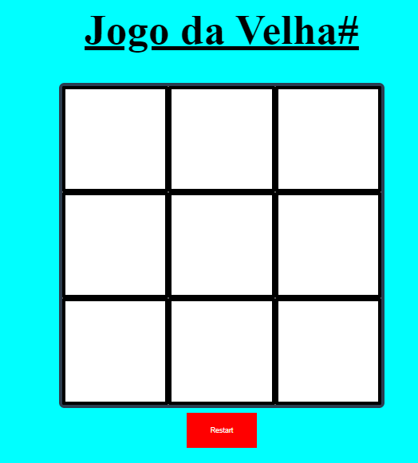
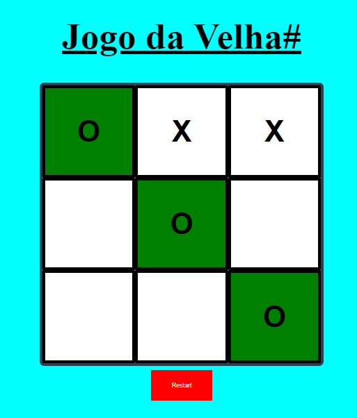

# Jogo_Da_Velha

Um simulador de jogo da velha em que o usuario coloca os "x" e "o" nas grades da rachtag, ganhando quem conseguir fazer uma sequencia de três.

## Modificações:
1° Incluimos um título através do h1.
2° Alteramos o tamanho do botão.
3° Alteramos as cores dos "X" e "O".
4° Alteramos o fundo.
5° Alteramos a cor das grades.
6° Alteramos o fundo das grades.
7° Alteramos para Funcao.css

## Tecnologias utilizadas:
- **HTML:** _Estrutura do SITE_
- **CSS:** Estilos do SITE
- **JS:** Funções do SITE
- ~~BootStrap~~: Não foi utilizado

##Melhorias Possíveis
1. [ ] Alert de vitória.
2. [ ] Realizar teste para descobrir bugs🕷

## disponível em:
[GitHubPage]()

## Prints da Tela do WebApp

|    Tela inicial     |     Tela de Vitória     |
|-------------------- | ------------------------|
|    |    | 

Referência [#CDFTV channel](https://www.youtube.com/codigofontetv).  

